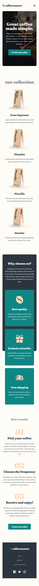

# Frontend Mentor - Coffeeroasters subscription site solution

This is a solution to the [Coffeeroasters subscription site challenge on Frontend Mentor](https://www.frontendmentor.io/challenges/coffeeroasters-subscription-site-5Fc26HVY6). Frontend Mentor challenges help you improve your coding skills by building realistic projects.

### Links

- Solution URL: [Frontend Mentor Solution Page](https://www.frontendmentor.io/solutions/coffeeroasters-subscription-site-z8LGw1l3DH)
- Live Site URL: [GitHub Pages Site](https://karolbanat.github.io/coffeeroasters-subscription-site/)

### Useful resources

- [ARIA APG](https://www.w3.org/WAI/ARIA/apg/patterns/) - For custom radio button and modal

## Author

- Frontend Mentor - [@karolbanat](https://www.frontendmentor.io/profile/karolbanat)

### Screenshot

